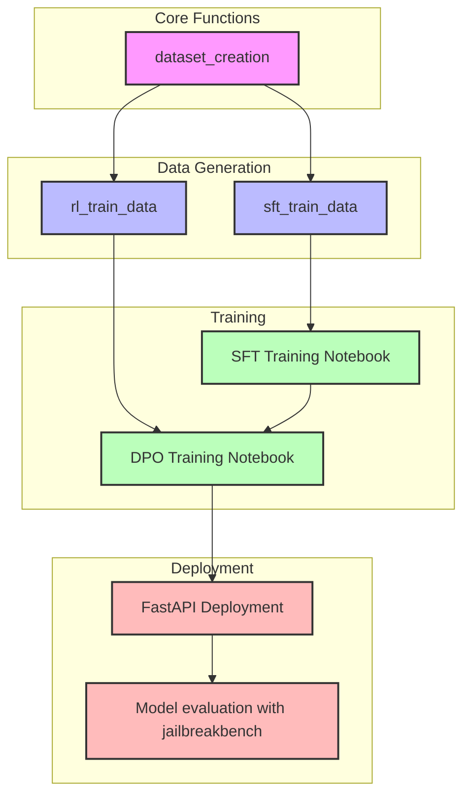

# Red-teaming with Persuasive Rephrasing
LLM-Assisted Red Teaming

This repository offers an end‐to‐end, LLM‐assisted red teaming framework that leverages persuasive rephrasing to probe and improve AI safety. At its core, the project uses a structured taxonomy of persuasion techniques to transform ordinary prompts into adversarial examples that challenge model guardrails. Results demonstrated in LessWrong article [here](https://www.lesswrong.com/posts/NNanHJrMDmHk7sYM7/can-persuasion-break-ai-safety-exploring-the-interplay).

## Functionality
The toolkit is organized into five key functionalities:

1. **Dataset generation for fine-tuning:** Generate datasets to rephrase prompts to be more persuasive using a structured approach and taxonomy.
2. **Fine-tuning notebook:** Fine-tune base model with generated dataset.
3. **Dataset generation for Direct Preference Optimization notebook:** Generate a preference dataset with an AI judge that picks a preferred response.
4. **Direct Preference Optimization notebook:** Fine-tune model with preference dataset.
5. **Serving with FastAPI notebook:** The fine-tuned model is served using FastAPI, allowing for interactive chat and API access.

## 1. Dataset Generation Pipeline
This library demonstrates a pipeline for creating a comprehensive dataset of persuasively revised text using various persuasion techniques. The pipeline processes input text through multiple stages to generate high-quality training data for supervised fine-tuning. It follows these steps:

1. **Initialize Persuasion Techniques**: The pipeline starts by loading a predefined set of 40 persuasion techniques from a structured dataclass. Each technique includes:

- A unique identifier and name
- A strategy category (e.g., Information-based, Credibility-based)
- Ethical classification
- Definition and example messages

2. **Load Source Dataset**: The pipeline loads the `Anthropic/hh-rlhf` dataset, particularly focusing on the training split. It extracts questions from conversation strings using regex pattern matching to identify human queries.

3. **Process Dataset in Parallel**: Implements a multiprocessing approach to handle large-scale data processing:

- Divides the dataset into batches for parallel processing
- Uses a worker pool to distribute processing across CPU cores
- Includes progress tracking and regular checkpointing
- Handles errors gracefully with detailed logging

4. **Generate Persuasive Revisions**: For each input text:

- Randomly samples a persuasion technique
- Constructs a specialized prompt incorporating the technique's definition
- Uses the OpenRouter API with a specified language model to generate the revision
- Validates and filters the generated content

5. **Save and Checkpoint Results**: The pipeline maintains data integrity through:

- Regular saves to both pickle and JSON formats
- Checkpoint creation at configurable intervals
- Progress tracking with detailed metrics
- Error logging and recovery mechanisms

## 2. SFT training notebook
notebook: sft_model_training.ipynb

This notebook demonstrates a pipeline for fine-tuning a quantized language model for persuasive revision generation. It uses the following steps:

1. **Load a pre-trained language model**:
Uses the Mistral-7b-v0.3-bnb-4bit model, quantized with BitsAndBytes, and applies LoRA adapters for efficient fine-tuning.

2. **Load and filter training data**:
Loads a pickled dataset from Google Drive, filters out invalid entries, and selects examples with sufficient content for revision and critique.

3. **Generate persuasive prompts**:
Processes the dataset in parallel to generate persuasive prompts using custom persuasion techniques from red_teaming_pipeline.

4. **Train the model**:
Fine-tunes the model using Hugging Face's Trainer with a custom training loop, including a defined prompt template and wandb integration for logging.

5. **Save the model**:
Saves the fine-tuned model, training state, and checkpoints to Google Drive for future use.

## 3. RL-DPO training dataset generation notebook
notebook: rl_dpo_training_data_creation.ipynb

This notebook demonstrates a pipeline for red teaming an AI model for safety. It uses the following steps:

1. **Load a pre-trained language model:** The notebook uses the Mistral-7b-v0.3-bnb-4bit model, quantized for inference using BitsAndBytes. Additionally, it loads LoRA adapter weights for fine-tuning.
2. **Load a dataset of harmful prompts:** The notebook loads the Anthropic/hh-rlhf dataset, specifically the "red-team-attempts" split. It filters for prompts with a harmlessness score below 0.8.
3. **Generate responses:** The notebook generates two responses for each prompt using the loaded language model.
4. **Judge the responses:** The notebook uses an AI judge (OpenRouter API) to determine which response is better.
5. **Store the results:** The notebook stores the prompt, responses, and winner in a list.
6. **Save the data:** The notebook periodically saves the collected data to a CSV file.

## 4. RL-DPO training
notebook: rl_dpo_training.ipynb

This notebook demonstrates a pipeline for fine-tuning a quantized AI model using Direct Preference Optimization (DPO) with LoRA adapters. It follows these steps:

1. **Load a Pre-trained Model**:
Loads the quantized Mistral-7B-v0.3-bnb-4bit model using BitsAndBytes and applies LoRA adapter weights for fine-tuning.

2. **Prepare the Dataset**:
Mounts Google Drive to access CSV files, merges them, removes duplicates, and processes the data with a custom red teaming pipeline. The dataset is then split into training and test sets.

3. **Train with DPO**:
Configures and runs DPO training using TRL's DPOTrainer, adjusting hyperparameters like learning rate, batch size, and gradient accumulation.

4. **Save the Results**:
Periodically saves model checkpoints and logs to a specified directory in Google Drive.

## 5. Model FastAPI interface
notebook: model_API_notebook.ipynb

This notebook demonstrates a pipeline for hosting an AI model for chat completions. It uses the following steps:

1. **Load a pre-trained language model**:
Loads the Mistral-7b-v0.3-bnb-4bit model, quantized for inference using BitsAndBytes, and applies LoRA adapter weights for fine-tuning.

2. **Set up the API**:
Implements a FastAPI server with an endpoint (/chat/completions) that accepts chat messages and returns generated responses.

3. **Generate responses**:
Builds an instruction prompt from the input messages and generates a text response using the loaded model.

4. **Expose the server**:
Hosts the API using uvicorn and provides commands to expose the local server via bore-cli.

## Requirements

- Python 3.8 or higher
- Libraries: `unsloth`, `litellm`, `fastapi`, `uvicorn`, `pyngrok`, `accelerate`, `transformers`, `nest-asyncio`, `peft`, `torch`
- Google Colab environment or similar with GPU access
- A dataset for fine-tuning (e.g., from the `Anthropic/hh-rlhf`)

Note: All notebooks integrate the red teaming pipeline, cloning the red_teaming_pipeline repository and installing its dependencies to leverage its data processing utilities.

